# BrowserTech
Bij browser tech is het de opdracht om in de stijl van de NS een erfbelastingsformulier te maken op basis van de techniek progressive enhancement. Ik wil voornamelijk focussen op slimme systemen met css bouwen om validatie zo goed mogelijk te laten werken. Ik ga dit doen bij een aantal verschillende stukken van het erfbelastings formulier.

## valideren met Has en After
Ik heb veel gedaan met has en After om goede validatie te creeeren. Ik had natuurlijk de inputs aan kunnen passen door de omlijning groen of rood te maken op user-valid en user-invalid, dit heb ik natuurlijk ook gedaan: 
 
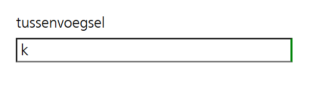
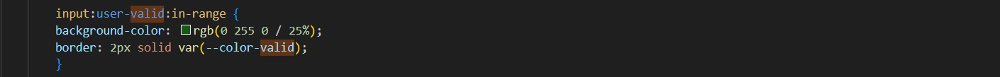

maar ik heb nog een aantal andere dingen toe gevoegd om dit nog wat beter te laten zien voor mensen die bijvoorbeeld kleurenblind zijn. Dit heb ik gedaan door after te gebruiken op de label als hij een valide, invalide of required input vel in zich heeft.

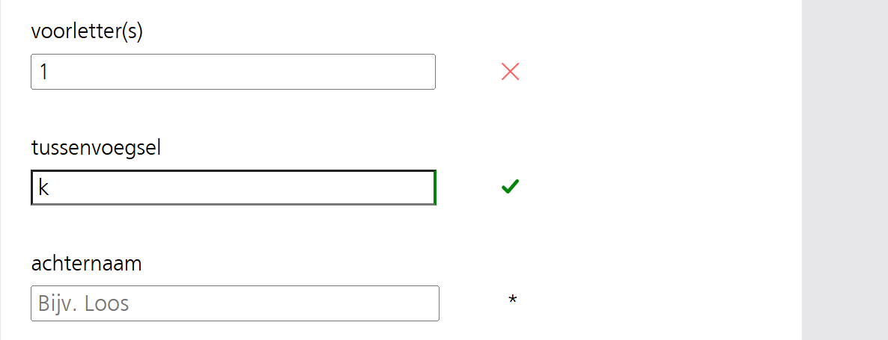
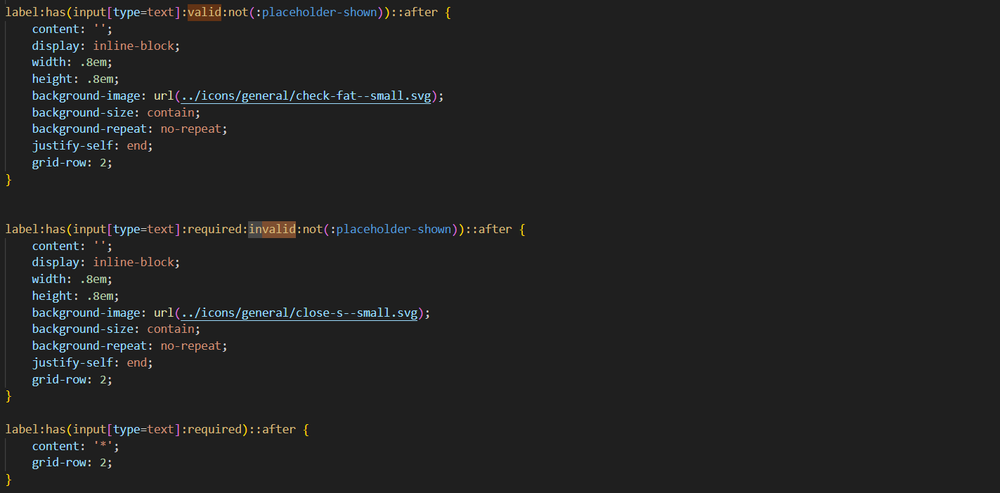

Nou bedacht ik me op een later moment dat alleen een kruisje en een checkje niet goed genoeg is om duidelijk te maken wat er dan fout gaat. Hierom heb ik nog een aantal extra tekstjes toe gevoegd om te singaleren wat er fout is gegaan bij het invullen van het formulier. Dit doe ik ook weer met een has statement.

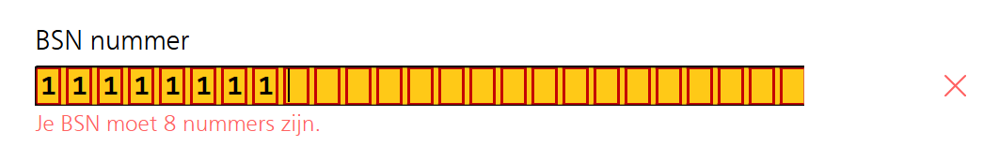

Wat mijn doel was  om de validatie zo zorgvuldig mogelijk te doen en zo duidelijk mogelijk te zijn zodat er niks fout gaat.

## Has gebruiken voor progresive disclosure

Er is een bepaalde sectie binnen het formulier waar je alleen 1b 1c en 1d in hoeft te vullen als je op 1a, ja hebt ingevuld. Dit doe ik ook weer met javascript, eerst dacht ik dat ik dit zou doen met has maar dit bleek niet handig te zijn als ik ze daarna ook nog required wou maken als ze open gingen. Als ik dit met bijde css en javascript had moeten doen dan zou er een kans zijn dat het breekt als de javascript het niet doet maar css wel. 
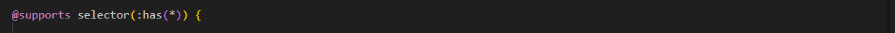
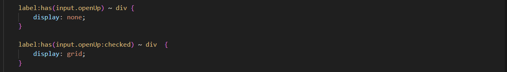
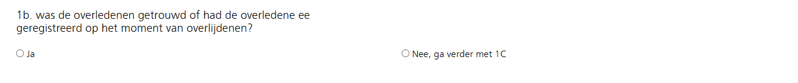

Nu is het wel nodig om de onderdelen required te maken zodra ze open gaan.

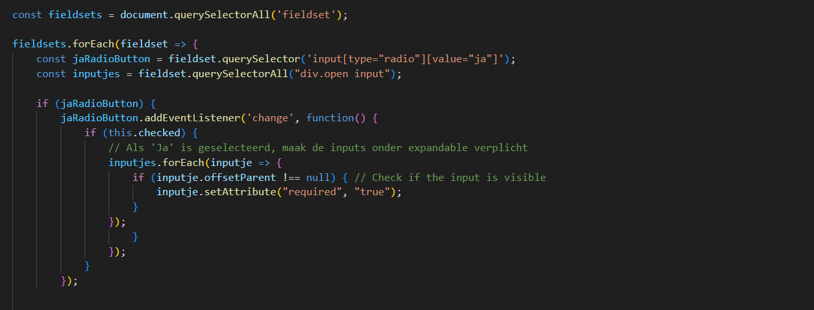

## NS stijling

In week 1 heb ik gewerkt aan de het voorbereiden van mijn bestand. Hierin wou ik dat de NS style al was verwerkt en dat de standaard styling voor de secties waar het formulier in kwam klaar waren. Hiernaast heb ik bedacht welk gedeelte van het formulier ik zou gaan maken en heb ik een idee bedacht voor de UX. De UX is het onderdeel waar ik het meeste op wil focussen in deze opdracht.

Hier onder zie je een plaatje waarin ik de NS stijling heb toe gepast.

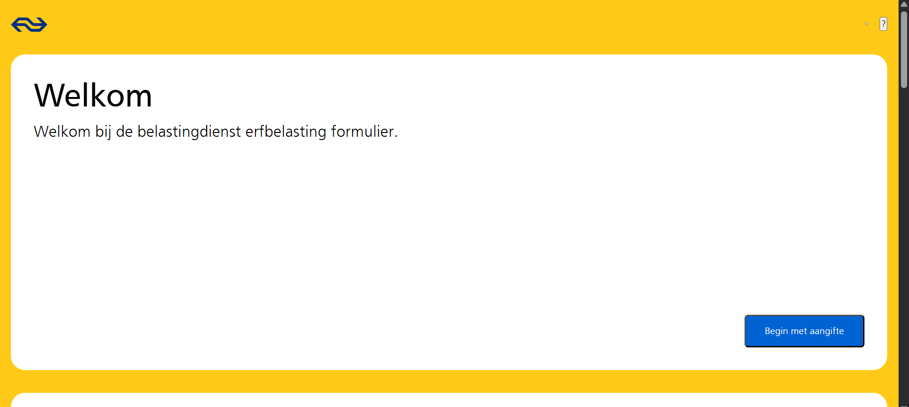

## gebruik van target

Ik heb gebruik gemaakt van :target om het formulier in meerdere stukken te delen. Dit doe ik om de gebruiker niet in een keer te overweldigen met veel informatie. Dit doe ik ook weer met @supports zodat het niet breekt zodra target niet word gesuport.

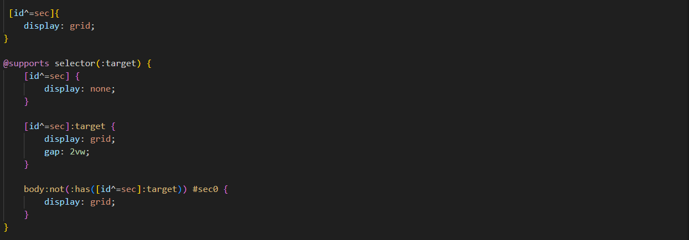

Om te zorgen dat mensen wel eerst volledig klaar zijn met de pagina voordat ze door gaan naar de volgende. Hiervoor heb ik een stuk code geschreven. Dit doe ik met javascript. Ik wou dat het anders kon of dat ik eigenlijk alles met javascript had gedaan want dan zou ervoor zorgen dat het altijd zou werken als javascript werkt en zo niet dat het dan gewoon open zou staan. Dit was beter geweest omdat ik het nu gechijden heb en dit ervoor kan zorgen dat het maar deels werkt zoals ik dat zou willen. Dit kan ik de volgende keer beter bij elkaar houden.

<code>
const volgendeLinks = document.querySelectorAll('a[id^=volgende]');
const sections = document.querySelectorAll('[id^=sec]');

volgendeLinks.forEach(link => {
    link.addEventListener('click', function(event) {
        const section = this.closest('[id^=sec]');
        const inputs = section.querySelectorAll('input[required]');
        let allFilled = true;

        inputs.forEach(input => {
            if (!input.checkValidity()) {
                allFilled = false;
            }
        });

        if (!allFilled) {
            event.preventDefault();
            alert('Please fill all the required input fields in the section.');
        }
    });
});
</code>

## opslaan in localhistory

Ik heb code van Jeremy Keith gebruikt om alles op te slaan in de local storage. Ik heb hier nog een aantal aanpassingen op gedaan om alles ook op refreshen van de pagina de velden nog steeds gevuld te houden.

Dit is de code die alle localstorage items in het veld zet.
<code>
const inputFields = document.querySelectorAll("input");
 
inputFields.forEach((inputField) => {
    if (localStorage.getItem(inputField.id)) {
        inputField.value = localStorage.getItem(inputField.name);
    }
    inputField.addEventListener("input", () => {
        localStorage.setItem(inputField.name, inputField.value);
    });
});
</code>

## Wat heb ik geleerd
Ik had voor bt nog nooit een formulier gemaakt met html en css. Hierom was bijna alles wat ik tijdens dit vak deed nieuw. Ik vond het erg leuk om dit eens uit te proberen aangezien dit voor mijn gevoel de ultieme combinatie van UX en developement is. Het was erg interesant om te zien hoe ver ik kon komen met alleen maar html en daarna te kijken wat ik er allemaal bovenop kon bouwen met css en javascript. Has statements waren hier een erg groot onderdeel van en ik vond het geweldig om te kijken hoe ver ik daar mee kon komen. Ik heb veel geleerd over de nood van progressive enhancement en zal goed nadenken over hoe ik dit in andere projecten voort kan zetten.

### verbeteringen?
Ik had me graag wat meer willen verdiepen in een aantal andere structuren van het formulier. Ik heb hard gewerkt aan kleine details maar had graag nog wat verder willen gaan in het ontwikkellen van de rest van het formulier. Jammergenoeg kon dit niet door tijds nood. 

